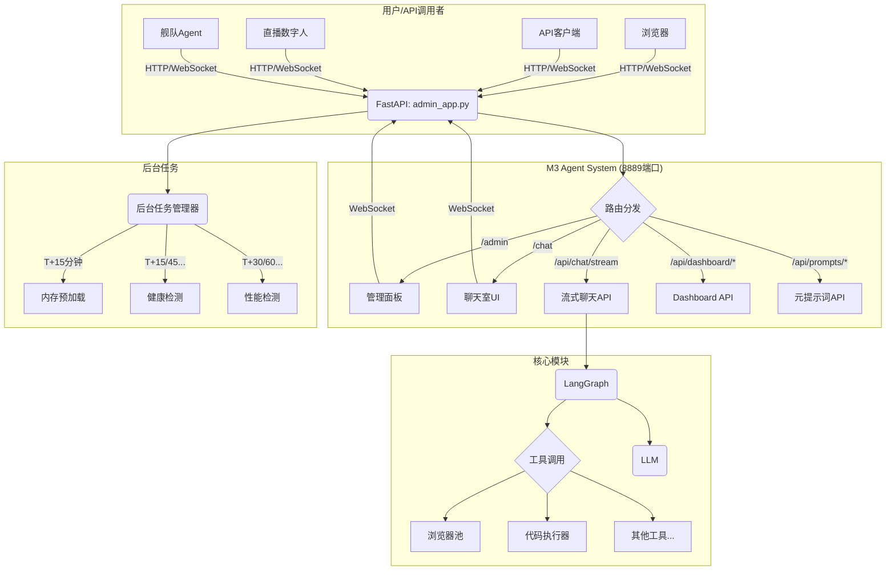

# M3 Agent v6.0 - 完整架构设计文档

**作者**: Manus AI
**日期**: 2025-12-05

---

## 1. 核心设计理念

M3 Agent v6.0的核心设计理念是**统一、可扩展、高性能**。

- **统一**: 将所有功能(Agent后端、管理面板、聊天室)整合到单一应用,通过单一端口访问。
- **可扩展**: 采用模块化设计,为未来舰队战略聊天室、多Agent协同预留空间。
- **高性能**: 保留v5.9的性能优化(浏览器池、模型预加载),并优化启动流程。

---

## 2. 整体架构

v6.0采用**混合部署**架构,将React前端(assistant-ui)编译为静态文件,由FastAPI后端统一提供服务。



### 关键组件

| 组件 | 技术栈 | 职责 |
|---|---|---|
| **admin_app.py** | FastAPI | 统一入口,路由分发,静态文件服务 |
| **管理面板** | HTML/JS | 系统监控,元提示词管理 |
| **聊天室UI** | React (assistant-ui) | 三方可见聊天室,思维链可视化 |
| **流式聊天API** | FastAPI (SSE) | 统一的聊天API,支持共享/独立会话 |
| **LangGraph** | LangChain | Agent核心工作流 |
| **浏览器池** | Playwright (sync) | 高性能浏览器操作 |
| **后台任务管理器** | APScheduler | 延迟预加载,定时监控 |

---

## 3. 单一会话窗口设计

### 3.1. API设计

采用单一API端点,通过`thread_id`区分会话。

```python
POST /api/chat/stream
{
    "message": str,
    "thread_id": Optional[str] = "default_session",
    "source": Optional[str] = "user",
    "metadata": Optional[Dict[str, Any]] = None
}
```

- **thread_id**: 
  - `default_session` (默认): 共享会话
  - `uuid` (自定义): 独立会话
- **source**: 消息来源 (user/api/admin/livestream/fleet)
- **metadata**: 额外元数据 (角色、设备、权限等)

### 3.2. 数据流

1. 所有客户端(浏览器、API)默认调用`thread_id="default_session"`。
2. FastAPI将消息和`thread_id`传递给LangGraph。
3. LangGraph在同一个会话中处理消息。
4. LangGraph的流式输出通过SSE推送到所有订阅了`default_session`的客户端。
5. assistant-ui前端根据`source`字段渲染不同角色的消息。

### 3.3. 扩展性

- **新增角色**: 只需在调用时传入新的`source`值。
- **新增权限**: 只需在`metadata`中添加字段,并在元提示词中定义规则。
- **舰队模式**: 每个Agent有自己的`thread_id`,通过共享`thread_id`实现协同。

---

## 4. 部署方案

### 4.1. 编译前端

```bash
# 1. 进入chatroom_ui目录
cd /path/to/m3-agent-v6.0/chatroom_ui

# 2. 安装依赖
pnpm install

# 3. 编译为静态文件
pnpm run build

# 4. 静态文件输出到 dist/ 目录
```

### 4.2. 后端配置

在`admin_app.py`中挂载静态文件:

```python
from fastapi.staticfiles import StaticFiles

# 挂载聊天室UI
app.mount("/chat", StaticFiles(directory="chatroom_ui/dist"), name="chat")

# 挂载管理面板
app.mount("/admin", StaticFiles(directory="admin_ui/templates"), name="admin")

# 根路径重定向到聊天室
@app.get("/")
async def root():
    return RedirectResponse(url="/chat")
```

### 4.3. Docker部署

Dockerfile中需要包含前端编译步骤:

```dockerfile
# --- 前端编译 ---
FROM node:20-alpine AS builder
WORKDIR /app/chatroom_ui
COPY chatroom_ui/package*.json ./
RUN npm install -g pnpm
RUN pnpm install
COPY chatroom_ui/ .
RUN pnpm run build

# --- 后端 ---
FROM python:3.11-slim
WORKDIR /app

# 复制编译好的前端
COPY --from=builder /app/chatroom_ui/dist ./chatroom_ui/dist

# 复制后端代码
COPY . .

# 安装Python依赖
RUN pip install -r requirements.txt

# 暴露端口
EXPOSE 8889

# 启动
CMD ["uvicorn", "admin_app:app", "--host", "0.0.0.0", "--port", "8889"]
```

---

## 5. 总结

v6.0架构通过**混合部署**和**单一会话窗口**设计,实现了:

- ✅ **单一端口**: 简化部署和维护
- ✅ **功能统一**: Agent后端、管理面板、聊天室整合
- ✅ **高性能**: 保留浏览器池和模型预加载
- ✅ **高扩展性**: 为未来舰队模式奠定基础
- ✅ **优秀的用户体验**: 基于assistant-ui,视觉效果和交互体验一流

这个架构兼顾了**开发效率、部署简单、功能强大、未来可扩展**等多个方面,是M3 Agent系统迈向成熟的重要一步。
